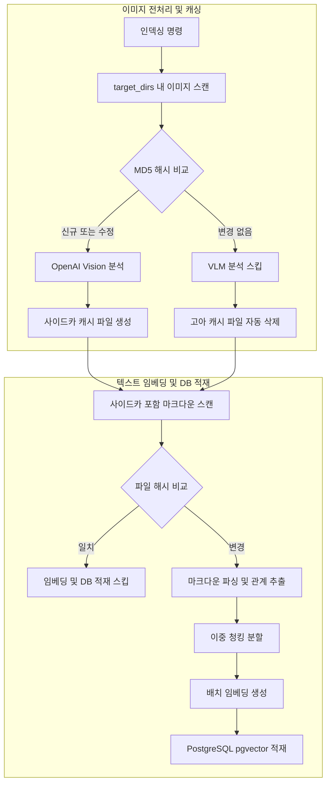
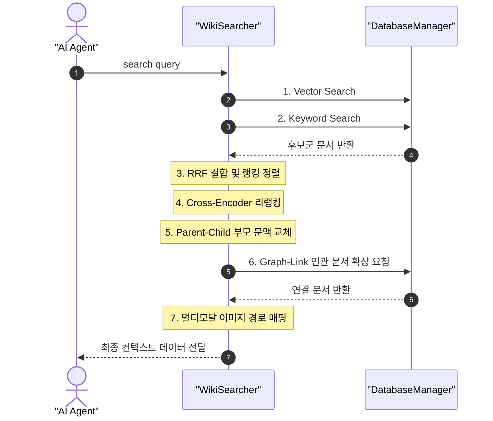

# LLM-Wiki: "나처럼 생각하는 AI"를 위한 멀티모달 개인/집단 지식베이스

> **"내가 쌓아온 고민과 대화 기록, 개발 환경 세팅의 의사결정을 그대로 지식화할 수 있다면? 사람이 바뀌어도 인수인계나 온보딩 없이 즉시 지식이 전수될 수 있다면? 그리고 같은 질문을 AI에게 반복하지 않아도 된다면?"**
>
> LLM-Wiki는 단순한 문서 데이터베이스 RAG 엔진이 아닙니다. 이 프로젝트는 **개인과 팀의 대화 흔적과 지식 파편들을 유기적으로 엮어, "나처럼 생각하고 나의 컨텍스트를 완벽히 이해하는 AI 비서"를 구축하기 위한 영속적 지식베이스 시스템**입니다.
> 
> 텍스트 검색에 국한되지 않고 아키텍처 구성도, 디자인 스타일, 에러 로그 등 **시각적 자산(이미지)까지 텍스트와 하나의 페이지 번들로 묶어 완벽한 멀티모달 지식베이스**로 전환합니다.

---

## 1. 핵심 아키텍처 및 폴더 구조 (Page Bundle)

지식베이스 내의 텍스트와 이미지 자산은 **Page Bundle (글별 독립 폴더)** 구조로 격리하여 관리합니다.

* **디렉토리 예시**:
  ```text
  qa/                                             [Q&A 저널 폴더]
  └── 2026-06-21/
      └── 1430-kubernetes-setup/                  (Page Bundle: 글 단위 독립 폴더)
          ├── 1430-kubernetes-setup.md            (본문 마크다운 파일)
          └── assets/                             (자동 생성된 미디어 폴더)
              ├── architecture-diagram.png        (원본 이미지)
              └── architecture-diagram.png.md     (VLM이 생성한 이미지 사이드카 캐시)
              
  topics/                                         [주제별 노트 폴더 - 물리 범주화]
  ├── Development/                                (관심사 대범주 폴더)
  │   ├── llm-agent.md                            (최신 메인 노트)
  │   └── archive/                                (카테고리-레벨 과거 이력 보관)
  │       └── llm-agent_20260628_0154.md          
  └── Finance/
      ├── 금리.md
      └── archive/
          └── 금리_20260629_1003.md
  ```
* **Obsidian 권장 설정**:
  * **새 첨부 파일을 생성할 위치**: `현재 폴더 아래의 하위 폴더` (하위 폴더 이름: `assets`)
  * **새로 생성하는 링크 형식**: `상대 경로`
  * **항상 업데이트되는 내부 링크**: `활성화`

---

## 2. 시스템 핵심 기능 및 워크플로우

### 1) 전체 인덱싱 및 이미지 전처리 워크플로우 (`main.py index`)

인덱싱 스크립트 실행 시 텍스트 파싱 전에 이미지 전처리가 먼저 가동되며, **2중 증분(Incremental) 필터링**을 거쳐 최소한의 API 비용과 시간만을 소모합니다.



* **에이전트 자체 멀티모달 분석 (Zero-Cost Direct Agent Vision)**: 외부 VLM API 호출을 100% 도려내어 이미지 전처리 비용을 0원으로 만듭니다. 인덱서(`ImageProcessor`)는 이미지의 메타데이터(경로, 태그)만 포함하는 가벼운 사이드카 문서(`.png.md`)를 로컬에 빠르게 자동 생성하며, 지식 검색 컨텍스트 융합 단계에서 에이전트(나)가 바인딩된 이미지 경로의 원본 바이트를 넘겨받아 직접 본인의 자체 Vision 기능(클라이언트)으로 실시간 해석합니다.
* **고아 사이드카 청소**: 로컬에서 원본 이미지 파일만 삭제되었을 경우, 매핑된 캐시 파일(`.png.md`)을 감지하여 로컬에서 자동 삭제하고 DB에서도 관련 벡터 데이터를 동기화하여 제거합니다.

---

## 3. 검색 및 RAG 컨텍스트 융합 워크플로우 (`src/searcher.py`)

사용자 쿼리가 들어왔을 때, 단순 벡터 검색에 의존하지 않고 다단계 하이브리드 리트리버를 거쳐 최종 생성 모델에 컨텍스트를 반환합니다.



1. **RRF 하이브리드**: 코사인 유사도 벡터 검색과 PostgreSQL GIN 인덱스 기반 Full-Text Search를 RRF 방식으로 융합합니다.
2. **Parent-Child RAG**: 데이터가 쪼개져 소실되는 것을 방지하기 위해, 문서는 300자 내외로 조밀하게 임베딩하고 검색 결과로 반환할 때는 더 넓은 부모 문맥(`parent_content`)으로 변경하여 반환합니다.
3. **Graph-Link RAG**: 매칭된 문서 본문 내에 적힌 `[[WikiLink]]` 엣지를 데이터베이스(`knowledge_edges`)에서 역추적하여 1촌 연결된 연관 문서를 검색 결과에 함께 확장 포함시킵니다.
4. **이미지 컨텍스트 결합**: 반환된 텍스트 중 `type: ImageSummary`가 존재할 시 이미지 파일의 상대경로를 에이전트에 함께 넘겨주어, 최종 에이전트 생성(Generation) 단계에서 원본 이미지 파일 바이트를 Vision 모델에 직접 전달할 수 있게 합니다.

---

## 4. 코드 설계 및 주요 모듈 구성 (Bounded Context 수직 슬라이싱)

### 1) 백엔드 핵심 코드 파일 및 패키지 구조
* [pyproject.toml](file:///Users/jw/__dev/knowledge/pyproject.toml): `hatchling` 및 `uv` 표준을 따르는 의존성 설정 파일.
* **Shared Kernel & Infrastructure**:
  * [src/infrastructure/database.py](file:///Users/jw/__dev/knowledge/src/infrastructure/database.py): DB 타입(Postgres/Sqlite)별 드라이버 팩토리.
  * [src/infrastructure/postgres_db.py](file:///Users/jw/__dev/knowledge/src/infrastructure/postgres_db.py): PostgreSQL 커넥션 생명주기 관리.
  * [src/infrastructure/sqlite_db.py](file:///Users/jw/__dev/knowledge/src/infrastructure/sqlite_db.py): SQLite 커넥션 생명주기 관리.
* **Wiki Bounded Context**:
  * [src/wiki/domain/parser.py](file:///Users/jw/__dev/knowledge/src/wiki/domain/parser.py): 마크다운 구조 분석, YAML Frontmatter 추출 및 위키링크 파싱.
* **Indexing Bounded Context**:
  * [src/indexing/domain/model.py](file:///Users/jw/__dev/knowledge/src/indexing/domain/model.py): Chunk(VO), Edge(Entity: 4대 신호 가중치 계산) 도메인 모델.
  * [src/indexing/application/service.py](file:///Users/jw/__dev/knowledge/src/indexing/application/service.py): 로컬-DB 비교 증분 인덱싱 파이프라인 제어 (병렬 처리 지원).
  * [src/indexing/infrastructure/repository.py](file:///Users/jw/__dev/knowledge/src/indexing/infrastructure/repository.py): DB 초기화, 데이터 적재/삭제 등 영속화 처리.
* **Retrieval Bounded Context**:
  * [src/retrieval/domain/model.py](file:///Users/jw/__dev/knowledge/src/retrieval/domain/model.py): Query(VO), RankFusion(Domain Service) 도메인 규칙 정의.
  * [src/retrieval/application/service.py](file:///Users/jw/__dev/knowledge/src/retrieval/application/service.py): 하이브리드 검색, RRF 결합, 리랭커 및 그래프 연관 확장 오케스트레이션.
  * [src/retrieval/infrastructure/repository.py](file:///Users/jw/__dev/knowledge/src/retrieval/infrastructure/repository.py): pgvector 벡터 및 FTS 키워드 DB 검색 쿼리 실행.
* **Media Bounded Context**:
  * [src/media/domain/model.py](file:///Users/jw/__dev/knowledge/src/media/domain/model.py): MediaFile, SidecarDocument 도메인 개체 정의.
  * [src/media/application/processor.py](file:///Users/jw/__dev/knowledge/src/media/application/processor.py): VLM 요약 추출 및 이미지 캐시 관리.
* **Interfaces**:
  * [src/interfaces/agent_tool.py](file:///Users/jw/__dev/knowledge/src/interfaces/agent_tool.py): AI 에이전트 연동용 스킬 API 엔트리포인트 ([retrieve_wiki_knowledge](file:///Users/jw/__dev/knowledge/src/interfaces/agent_tool.py#L8), [commit_wiki_knowledge](file:///Users/jw/__dev/knowledge/src/interfaces/agent_tool.py#L65), [run_wiki_indexing](file:///Users/jw/__dev/knowledge/src/interfaces/agent_tool.py#L255)).

---

## 5. 설치 및 시작 가이드

### 1) 환경 변수 설정 (`.env`)
`.env` 파일을 루트 디렉토리에 작성합니다.
```env
DB_HOST=localhost
DB_PORT=54320
DB_NAME=knowledge_db
DB_USER=postgres
DB_PASSWORD=postgres

# 임베딩 공급자: fake, openai, bge-m3
EMBEDDING_PROVIDER=openai
OPENAI_API_KEY=sk-proj-... # (VLM 이미지 분석용이 아닌, 오직 텍스트 임베딩 생성용으로 사용됩니다)
EMBEDDING_DIM=1536

# 지식베이스(Obsidian Vault) 루트 경로 (기본값: '.' 현재 프로젝트 디렉토리)
WIKI_DIR=.
```

* **`WIKI_DIR` 환경 변수**: 프로젝트 외부의 다른 폴더 경로(예: iCloud/Dropbox에 동기화되는 실제 Obsidian Vault 디렉토리)를 지식베이스 루트로 연동하고 싶을 때 사용합니다. 절댓값 혹은 상대경로를 지정할 수 있으며 지정된 경로 내의 `qa/`, `topics/`, `assets/`, `attachments/`를 자동으로 스캔 및 동기화합니다.


### 2) 가상환경 설정 및 의존성 설치 (`uv` 권장)
```bash
# 가상환경 생성 및 패키지 설치
uv venv
uv pip install -e .
```

### 3) CLI 구동 및 명령어
* **전체 지식베이스 인덱싱 (텍스트 & 이미지 일괄 증분 반영)**:
  ```bash
  python main.py index
  ```
* **하이브리드 시맨틱 검색**:
  ```bash
  python main.py search "쿠버네티스 레이아웃이 깨질 때 해결법" --limit 2
  ```

---

## 6. 지식 최신성 유지 파이프라인 (Knowledge Refresher)

로컬 지식들이 노화(Drift)되어 낡은 지식이 되는 것을 방지하기 위해, 범주형 스케줄 관리 및 자동 백업/병합 파이프라인을 구축해 운영합니다.

### 1) 시스템 아키텍처 및 폴더 구조
* **중앙 토픽 맵 (`.agents/topic_map.json`)**: 지식베이스 내 모든 토픽을 대범주 관심사(e.g., `Development`, `Finance`) 단위로 매핑 관리하는 마스터 인덱스입니다.
* **범주별 스케줄 (`.agents/schedules/`)**: 토픽 맵의 범주명과 1:1 매칭되는 개별 JSON 파일들(e.g., `Finance.json`)로 구성되며, 노정별 갱신 주기(`refresh_interval`), 수집 소스(`refresh_source`), 최종 갱신일(`last_refresh`)을 보관합니다.
* **커스텀 스킬 패키지 (`.agents/skills/knowledge_refresher/`)**: 
  - `SKILL.md`: 스킬 호출 메타데이터 규격서
  - `scripts/run_refresher.py`: 백그라운드에서 만료된 노트를 검사하고 최신 데이터를 긁어와 AI Drift 판정 및 임시 초안을 자동 생성하는 데몬 스크립트.
  - `scripts/notify_refresher.py`: 검출된 Drift 알림 대장(`.agents/drift_notifications.json`)을 표 형식으로 정돈하여 에이전트 브리핑을 돕는 보조 스크립트.

### 2) 병합(Merge) 및 아카이빙 격리 규칙
사용자가 갱신 승인(apply_merge)을 트리거할 때 작동합니다.
1. **아카이빙 격리**: 기존 원본 마크다운 문서 전체를 백업하여 각 관심사 카테고리 디렉터리 내부인 `topics/{Category}/archive/` 폴더 하위에 `[원본명]_[UTC타임스탬프].md` 포맷으로 자동 이관합니다. (아카이브 문서는 `type: Archive` 메타데이터를 부여받아 격리됩니다.)
2. **원본 노트 대체**: 원본 마크다운 본문은 지저분하게 추가 누적되지 않고, 최신 제안본(Suggested Merge)으로 **완전 대체**되어 늘 콤팩트하고 정확한 최신 뷰를 유지합니다.

### 3) 런타임 제약 사항 및 OCI 무중단 배포 가이드
* **Antigravity 의존성**: Antigravity 내장 `schedule` 도구를 사용해 등록된 백그라운드 크론은 **호스트 PC가 켜져 있고 Antigravity 런타임 프로세스가 실행 중일 때만 동작**합니다. PC 절전(Sleep) 혹은 오프라인 시에는 작업이 누락되거나 보류됩니다.
* **OCI 상시 배치 이식**: 로컬 환경 제약 없이 24시간 무중단 가동을 달성하기 위해 OCI(Oracle Cloud Infrastructure) 서버의 Native `crontab`에 스크립트를 직접 등록해 운영하는 방식을 권장합니다.
  ```bash
  # Linux crontab -e 설정 예시 (매일 자정 가동)
  0 0 * * * cd /path/to/knowledge && .venv/bin/python .agents/skills/knowledge_refresher/scripts/run_refresher.py >> /var/log/knowledge_refresher.log 2>&1
  ```

